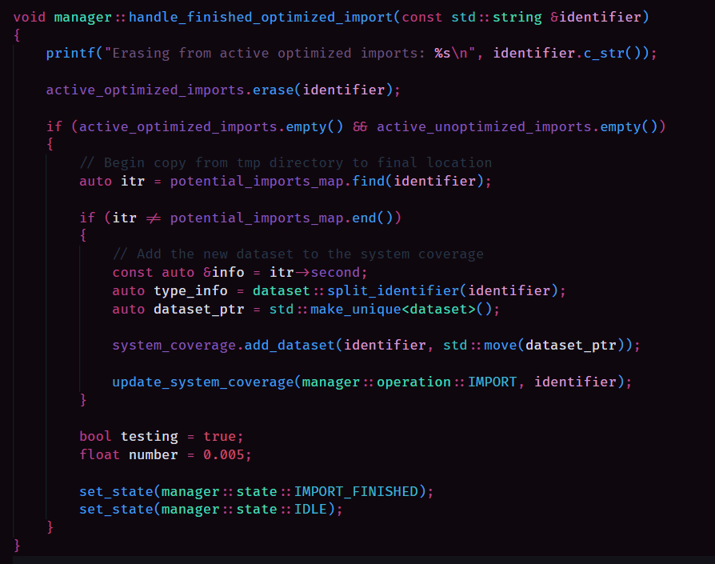

# 秋葉原 ・ Akihabara: A Night in Tokyo — Code Color Theory

Akihabara at night is neon over black: vivid signals guiding calm movement.
This theme applies that idea to code. Each **programming concept** gets a **base color family** (red / purple / blue / green→teal / yellow / orange), and each **subtype** gets a precise hue so your eyes learn “what kind of thing” before reading the word.

- **Values** ![chip][red] feel alive and immediate.
- **Control** ![chip][purple] is signage—clear routes, no cargo.
- **Actions** ![chip][blue] are the waterworks—they reshape.
- **State & Structure** ![chip][green] ![chip][teal] are where things live and organize.
- **Definitions ![chip][yellow] & Literals ![chip][yellow_literal]**  set shape and fixed atoms.
- **Parameters** ![chip][orange] are the in-flight handoff between value and state.

Designed for **long sessions**: high contrast on black, saturated but disciplined accents, and systematic semantics so large codebases feel navigable, not noisy.

---

# Color Design Philosophy

---

# Values / Information

**Idea & Rationale:** Values are the code’s **lifeblood** ![chip][red]. Keep the family in **red** ![chip][red] for “this is data.” Use brightness/hue to encode role; this stays distinct from **Actions** ![chip][blue] and **Control** ![chip][purple].

## Subtypes & Color Behavior

| Subtype           | Hex     | Name              | Metaphor                         | Role Cue                        |
|-------------------|---------|-------------------|----------------------------------|----------------------------------|
| Constants         | #A8304B | Amaranth Purple   | **Old blood** ![chip][red_const] | Immutable foundation             |
| Local Variables   | #D53D5C | Cerise            | **Fresh blood** ![chip][red_local] | Scoped, short-lived carriers     |
| Member Variables  | #904483 | Plum              | **Royal blood** ![chip][red_member] | Object identity & enduring state |

---

# Keywords / Flow Control

**Idea & Rationale:** Flow words are **traffic signals** ![chip][purple]—they **route** ![chip][purple] data; they don’t carry it. One confident **purple** ![chip][purple] unifies control and stays distinct from **Values** ![chip][red] and **Actions** ![chip][blue].

## Subtypes & Color Behavior

| Category                 | Examples                                                                 | Hex     | Name                              | Role Cue                 |
|--------------------------|--------------------------------------------------------------------------|---------|-----------------------------------|--------------------------|
| Branching                | `if`, `else`, `switch`, `case`, `default`                                | #7757BA | Royal Purple ![chip][purple_keyword] | Choose a path            |
| Looping                  | `for`, `while`, `do`                                                     | #7757BA | Royal Purple ![chip][purple_keyword] | Repeat a path            |
| Transfer                 | `return`, `break`, `continue`                                            | #7757BA | Royal Purple ![chip][purple_keyword] | Exit / skip / handoff    |
| Exceptions               | `try`, `catch`, `throw`                                                  | #7757BA | Royal Purple ![chip][purple_keyword] | Detour on error          |
| Misc Flow                | `goto`, labels                                                           | #7757BA | Royal Purple ![chip][purple_keyword] | Unstructured jump        |
| **Access / Declarations**| `public`, `protected`, `private`, `class`, `struct`, `namespace`, `interface`, `enum`, `union`, `template`, `using namespace`, scope `::` | #7757BA | Royal Purple ![chip][purple_keyword] | Visibility & structure   |

---

# Action / Transformation

**Idea & Rationale:** Callables are the system’s **waterworks** ![chip][blue]—they move and reshape data. Keep **blue** ![chip][blue] for “this acts,” with a greener tilt when action is state-aware. This separates **Actions** ![chip][blue] from **Values** ![chip][red] and **Control** ![chip][purple].

## Subtypes & Color Behavior

| Subtype   | Hex     | Name                         | Role Cue                          |
|-----------|---------|------------------------------|-----------------------------------|
| Function  | #00A5E0 | **Picton Blue** ![chip][blue_function] | Free-flowing transform            |
| Method    | #06A3C6 | **Pacific Cyan** ![chip][blue_method]  | Transform shaped by object/state  |

---

# State / Storage

**Idea & Rationale:** These are the **containers and grounds**—where information **lives** ![chip][green] or is **organized** ![chip][teal]. Use **green → teal** ![chip][green] ![chip][teal] to signal **state & structure**, distinct from **Values** ![chip][red] and **Control** ![chip][purple].

## Subtypes & Color Behavior

| Subtype    | Hex     | Name                | Role Cue                                   |
|------------|---------|---------------------|--------------------------------------------|
| Namespace  | #15A284 | **Zomp** ![chip][green_namespace] | Organizational scope (non-instantiable)    |
| Class      | #0EA3A5 | **Light Sea Green** ![chip][teal_class] | Owns/organizes object state                |

---

# Definitions / Primitives

# Definitions / Primitives

**Idea & Rationale:** These mark **shape** ![chip][yellow] and **literal atoms** ![chip][yellow_literal]. Keep **types** in pure yellow for “what it *is*,” and render **literals** in yellow-green for “the concrete value here,” distinct from **Values** ![chip][red], **Actions** ![chip][blue], and **Control** ![chip][purple].
**Note:** **Numbers** lean slightly green ![chip][yellow_literal] to emphasize their **discrete state**; **enum values** remain literal (yellow-green), while **enum type names** stay with the type family (pure yellow).

## Subtypes & Color Behavior

| Subtype          | Hex     | Name                | Role Cue                                     |
|------------------|---------|---------------------|----------------------------------------------|
| Types (incl. enum/class names) | #FAE57B | **Jasmine** ![chip][yellow_type]   | Type identifiers & fundamental types         |
| Strings          | #88C480 | **Pistachio** ![chip][yellow_literal] | Text literals (fixed in source)              |
| Booleans         | #88C480 | **Pistachio** ![chip][yellow_literal] | `true` / `false` literals                    |
| Numbers          | #88C480 | **Pistachio** ![chip][yellow_literal] | Discrete, fixed numeric state                |
| Enums (values)   | #88C480 | **Pistachio** ![chip][yellow_literal] | Enumerator values (enum *types* use Jasmine) |

---

# Parameters

**Idea & Rationale:** Parameters are **handoff points** ![chip][orange]—between **Values** ![chip][red] and **State** ![chip][green]. Use **orange** ![chip][orange] to signal “in-flight input/output” without conflating with locals or fields.

## Subtypes & Color Behavior

| Subtype   | Hex     | Name             | Role Cue                                      |
|-----------|---------|------------------|-----------------------------------------------|
| Parameter | #F47357 | **Burnt Sienna** ![chip][orange_parameter] | Per-call inputs/outputs, bound to scope       |

---

# Comments

- #3C354E Ultra Violet ![chip][gray_comment]

---

<!-- -->

## Recommendations
For best results, use **Fira Code Retina** (ligatures on). Consider **disabling Bracket Pair Colorization** to let Akihabara’s bracket/paren accents carry the structure.

## Feedback
If you encounter any issues, or have suggestions for improving this theme, please open an [issue][issue_link] on GitHub.

## Review
If you enjoy using the Akihabara theme, please consider leaving a review on the [marketplace][marketplace_link]. Your support and positive feedback will help others find this theme!

[fira_code_link]: https://github.com/tonsky/FiraCode 'FiraCode GitHub repository page'
[issue_link]: https://github.com/justinlavi/Akihabara/issues 'GitHub issue page'
[marketplace_link]: https://marketplace.visualstudio.com/items?itemName=justin-lavi.akihabara 'Visual Studio Marketplace page'

## Credits
* [**Semantic Rainbow**](https://thertzlor.github.io/semantic-rainbow/) - The color design for this theme was heavily inspired by thertzlor's "Semantic Rainbow" design philosophy.

[red]: ./assets/chips/red.png
[red_local]: ./assets/chips/red_local.png
[red_const]: ./assets/chips/red_const.png
[red_member]: ./assets/chips/red_member.png

[purple]: ./assets/chips/purple.png
[purple_keyword]: ./assets/chips/purple_keyword.png

[blue]: ./assets/chips/blue.png
[blue_function]: ./assets/chips/blue_function.png
[blue_method]: ./assets/chips/blue_method.png

[green]: ./assets/chips/green.png
[green_namespace]: ./assets/chips/green_namespace.png

[teal]: ./assets/chips/teal.png
[teal_class]: ./assets/chips/teal_class.png

[yellow]: ./assets/chips/yellow.png
[yellow_type]: ./assets/chips/yellow_type.png
[yellow_literal]: ./assets/chips/yellow_literal.png

[orange]: ./assets/chips/orange.png
[orange_parameter]: ./assets/chips/orange_parameter.png

[gray_comment]: ./assets/chips/gray_comment.png
