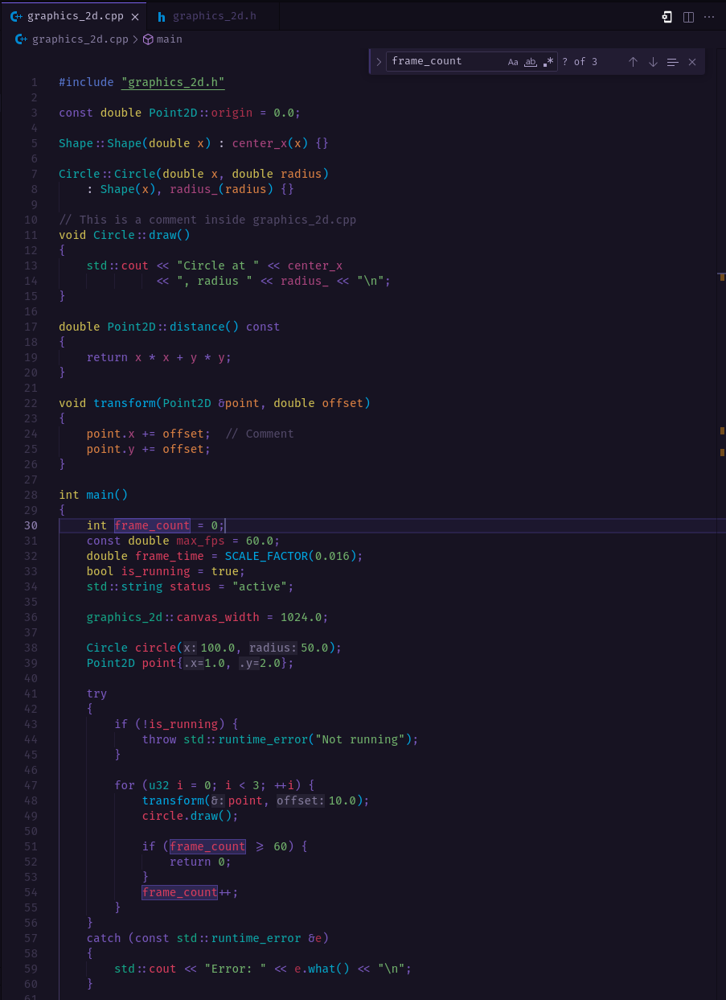
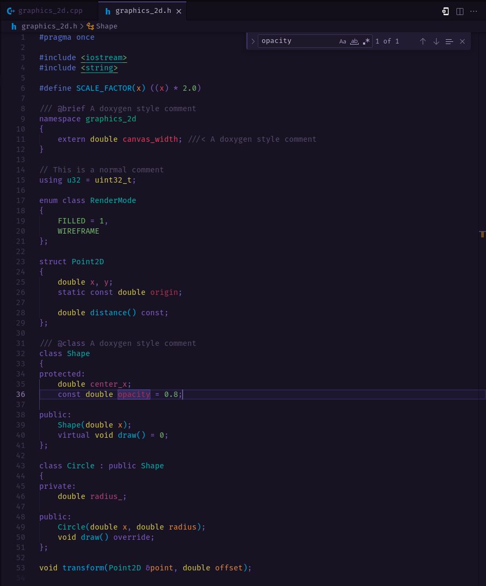

# 秋葉原 ・ Akihabara: A Night in Tokyo — Code Color Theory

> Example (C++)

  

Akihabara at night is neon over black: vivid signals guiding calm movement.
This theme maps that idea to code: **each concept = a color family**, and **each sub-role = a nearby hue**. Your eyes learn the category before your brain parses the token.

Designed for **long sessions**: high contrast on black, saturated but disciplined accents, and semantic consistency so big codebases feel navigable—not noisy.

---

## Table of Contents

- [Order of Concepts (and why)](#order-of-concepts-and-why)
- [Color Design Philosophy](#color-design-philosophy)
- [Keywords / Control 🟪](#keywords--control-)
- [Definitions / Primitives 🟡](#definitions--primitives-)
- [State / Storage 🟢/🧊](#state--storage-)
- [Action / Transformation 🔵](#action--transformation-)
- [Parameters 🟧](#parameters-)
- [Values / Information 🔴](#values--information-)
- [Documentation 🩶](#documentation-)
- [Quick Mental Model](#quick-mental-model)
- [Color Table](#color-table)
- [Installation](#installation)
- [Recommendations](#recommendations)
- [Feedback](#feedback)
- [Credits](#credits)

---

## Order of Concepts (and why)

1) **Keywords / Control** 🟪 — shapes and directs execution
2) **Definitions / Primitives** 🟡 — declares identity and atoms
3) **State / Storage** 🟢/🧊 — where things live and how they’re organized
4) **Action / Transformation** 🔵 — what code does (movement/change)
5) **Parameters** 🟧 — handoff points at call/def sites
6) **Values / Information** 🔴 — the data itself

This descends by **scope impact**: structure → identity → containers → operations → interfaces → payload.

---

## Color Design Philosophy

- **One family per concept** for instant recognition: Control 🟪, Types/Literals 🟡, State 🟢/🧊, Actions 🔵, Parameters 🟧, Values 🔴.
- **Hue drift within the family** clarifies sub-roles (e.g., function vs. method both 🔵, but adjacent blues).
- **Thermal logic:** hot **payload** 🔴 vs. cool **machinery** 🔵🟪; **ground** 🟢/🧊 stabilizes; **identity** 🟡 and **handoff** 🟧 annotate.

---

## Keywords / Control 🟪

**Intent:** Flow words are signage—they **route**, they do not carry. A unified purple keeps the skeleton obvious and prevents “rainbow control.”

**Includes:**
- Branching, looping, transfer, exceptions, labels
- Visibility and declaration keywords (`class`, `struct`, `namespace`, `enum`, `union`, `template`, access specifiers, scope `::`)

**Why purple?** 🟪 It reads as structural and slightly formal—great for “map first, details later.”

---

## Definitions / Primitives 🟡

**Intent:** Declare **what things are** (types) and the **fixed atoms** in source (literals).

**Includes:**
- Fundamental and user types (incl. enum/class names)
- Literal tokens (numbers, booleans, strings, enumerators)

**Why yellow?** 🟡 It pops early in peripheral vision—ideal for type identity and atomic constants without competing with control (🟪) or calls (🔵).

---

## State / Storage 🟢/🧊

**Intent:** The **ground** and **containers**—where information lives and how it’s organized.

**Includes:**
- Namespaces, classes, and other scope/ownership carriers

**Why green→teal?** 🟢 implies stability/ground; drift toward 🧊 (teal/cyan) hints structured, persistent context (namespaces/classes) without reading as “action.”

---

## Action / Transformation 🔵

**Intent:** The **waterworks**—things that move or reshape data.

**Includes:**
- Functions and methods (with a subtle hue split to signal free vs. state-aware actions)

**Why blue?** 🔵 Cool = motion/change, complementary to hot data 🔴 and separate from routing 🟪.

---

## Parameters 🟧

**Intent:** **Handoff points**—the interface binding values to operations and state.

**Includes:**
- Function and method parameters at both declaration and call sites

**Why orange?** 🟧 Warm enough to relate to data 🔴, distinct enough to read as an **interface**, not payload or control.

---

## Values / Information 🔴

**Intent:** The **lifeblood**—actual data in motion or at rest.

**Includes:**
- Constants, locals, members (with variations for lifetime/scope while staying in-family)

**Why red?** 🔴 High salience indicates “this carries content,” clearly apart from machinery (🔵🟪).

---

## Documentation 🩶

Muted guidance that recedes but remains legible.
(They should never shout over the code map.)

---

## Quick Mental Model

- **See purple** 🟪 → “this routes”
- **See yellow** 🟡 → “this defines / is a literal”
- **See green/teal** 🟢/🧊 → “this contains / organizes”
- **See blue** 🔵 → “this acts”
- **See orange** 🟧 → “this interfaces (params)”
- **See red** 🔴 → “this is the data”

---

## Color Table

| Family | Type | Hex | Swatch Name |
|--------|------|-----|-------------|
| **Control** 🟪 | *Branching* (`if`, `else`, `switch`) *Looping* (`for`, `while`, `do`) *Transfer* (`return`, `break`, `continue`) *Exceptions* (`try`, `catch`, `throw`) *Access & declarations* (`public`, `private`, `class`, `namespace`, `::`), etc. |  `#7757BA` | Royal Purple |
| **Definitions / Primitives** 🟡 | *Type identifiers* (built-ins & user types; enum/class names, e.g., `int`, `void`) |  `#CBBB52` | Old Gold |
| **Definitions / Primitives** 🟡 | *Literals* — numbers, booleans, strings, enum values (e.g., `42`, `true`, `"hello"`) |  `#70AF6B` | Asparagus |
| **State / Storage** 🟢/🧊 | *Namespace* (organizational scope; not instanced, e.g., `std::`) |  `#15A284` | Zomp |
| **State / Storage** 🟢/🧊 | *Class* (owns/organizes object state, e.g., `MyClass` as type) |  `#0EA3A5` | Light Sea Green |
| **Action / Transformation** 🔵 | *Function* (free, stateless transform, e.g., `func()`) |  `#00A5E0` | Picton Blue |
| **Action / Transformation** 🔵 | *Method* (state-aware transform, e.g., `obj.method()`) |  `#06A3C6` | Pacific Cyan |
| **Parameters** 🟧 | *Function/method parameters* (per-call inputs/outputs, e.g., `param` in `func(param)`) |  `#D77F43` | Caramel |
| **Values / Information** 🔴 | *Constants* (immutable values, e.g., `const PI`) |  `#A8304B` | Amaranth Purple |
| **Values / Information** 🔴 | *Local variables* (short-lived, scoped, e.g., `int x`) |  `#D53D5C` | Cerise |
| **Values / Information** 🔴 | *Member variables* (object state / fields, e.g., `obj.member`) |  `#A7447C` | Magenta Haze |
| **Documentation** 🩶 | *Comments* (subtle, legible, e.g., `// comment`) |  `#514867` | English Violet |
| **Documentation** 🩶 | *Doxygen* (light highlight, e.g., `// @brief, @class`) |  `#604E87` | Ultra Violet |

---

## Installation

Install directly from the [Visual Studio Marketplace][marketplace_link], or search for "Akihabara" in VS Code Extensions.

---

## Recommendations

- **Font:** [Fira Code Retina][fira_code_link] (with ligatures enabled).
- Consider disabling **Bracket Pair Colorization** in VS Code settings—this lets Akihabara’s semantic accents handle structure without interference.

---

## Feedback

If you encounter any issues or have suggestions for improving this theme, please open an [issue][issue_link] on GitHub.

---

## Credits

[Semantic Rainbow](https://thertzlor.github.io/semantic-rainbow/) - The color design for this theme was heavily inspired by thertzlor's "Semantic Rainbow" design philosophy.

[fira_code_link]: https://github.com/tonsky/FiraCode 'FiraCode GitHub repository page'
[issue_link]: https://github.com/justinlavi/Akihabara/issues 'GitHub issue page'
[marketplace_link]: https://marketplace.visualstudio.com/items?itemName=justin-lavi.akihabara 'Visual Studio Marketplace page'
